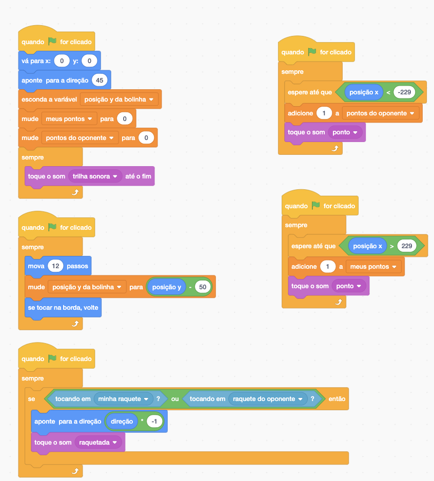
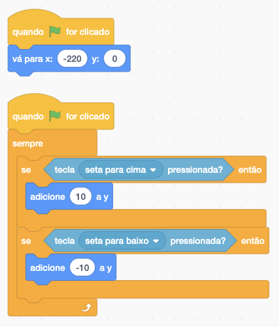
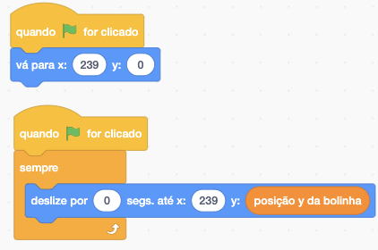
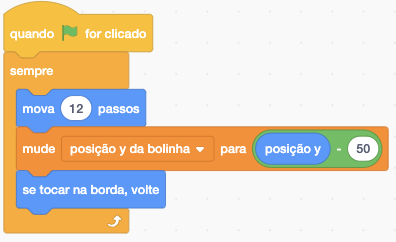
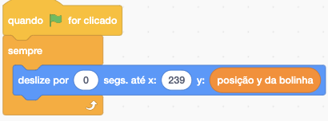
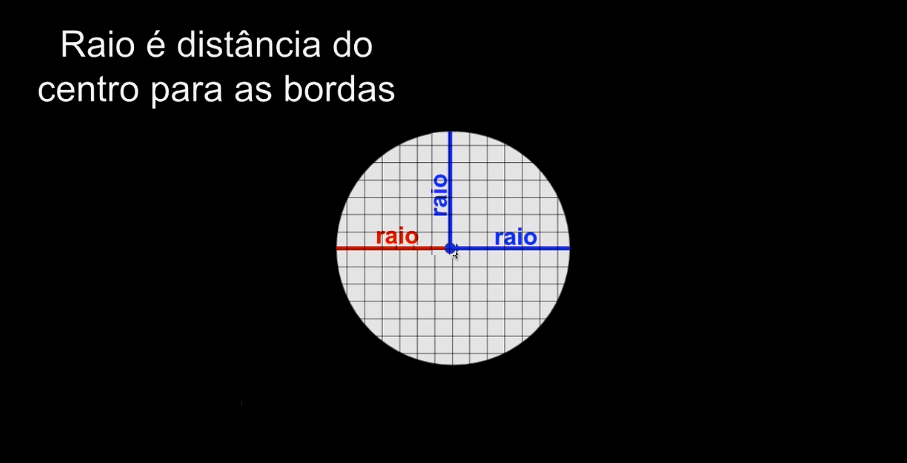
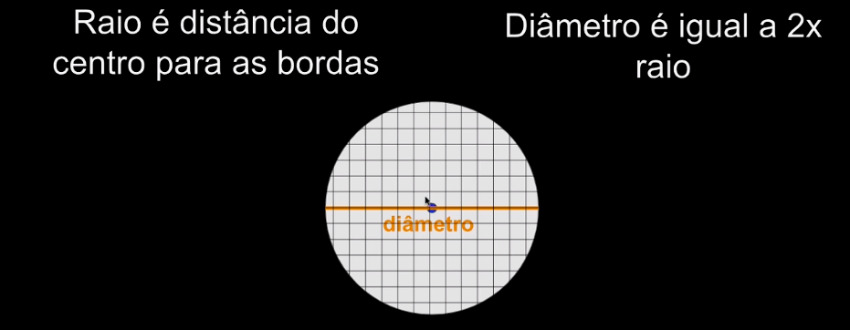
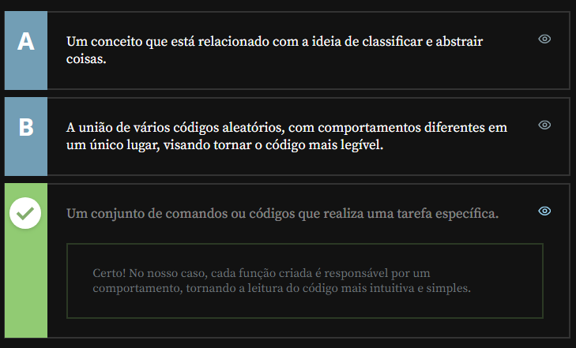
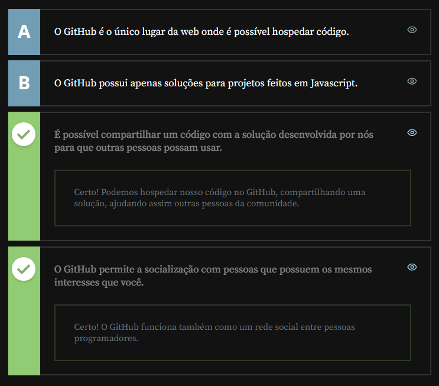

# Curso de Jogos clássicos parte 1: Iniciando no JavaScript com Pong

<!-- LEGENDAS para ÍCONES:
  - :link:               = Links da web
  - :running::dash:      = Fazendo
  - :books:              = Conteúdo
  - :memo:               = Exercícios
  - :white_check_mark:   = Feito
  - :dart:               = Módulo Concluído
  - :trophy:             = Medalhas
  - :information_source: = Informação importante
  - :name_badge:         = Certificado
  - :warning:            = Prioridades
  - :page_facing_up:     = para Artigos
  - :tada:               = para Eventos
  - :notebook:           = Conteúdo extra com Livro
  - :blue_book:          = Conteúdo extra da Alura+
  - :headphones:         = Conteúdo em áudio
  - :tv:                 = Conteúdo em vídeo
-->

:link: <https://cursos.alura.com.br/course/pong-javascript>

> **Faça esse curso de Lógica de promgração e:**
> - Desenvolva um jogo do zero em duas linguagens de promgração diferentes
> - Dê seus primeiros passos no mundo do JavaScript
> - Aprenda a trabalhar com variáveis e funções
> - Crie um jogo completo, com animações, controles, sons e placar
> - Saiba como utlizar em seus projetos um código compartilhado no Github.

---

## AULAS

### **Pong no Scratch**

#### Introdução
>
> (...) e neste curso iremos desenvolver o primeiro jogo lucrativo da história, um jogo de esporte conhecido por Pong, que simula um tênis de mesa. (...)
>
> Inicialmente, vamos desenvolvê-lo utilizando a linguagem Scratch. (...) Em seguida, após aperfeiçoarmos nossa lógica de programação, desenvolveremos o mesmo jogo utilizando outra linguagem, o JavaScript.

#### Preparando o ambiente
>
> Olá, neste curso vamos criar um jogo do zero, utilizando duas linguagens de programação diferentes: [Scratch](https://scratch.mit.edu/) e [Javascript](https://www.caelum.com.br/apostila-html-css-javascript/38CA-eventos-com-javascript#caracteristicas-da-linguagem) dentro do [P5](https://editor.p5js.org/).
> 

> Neste treinamento, não usaremos uma IDE como VSCode, pois para executar a biblioteca precisaríamos subir um servidor e esse não é o objetivo do curso. Vamos dedicar toda atenção apenas no JavaScript.
> 

>
> Vamos desenvolver o jogo do [Pong](https://pt.wikipedia.org/wiki/Pong), que é um jogo eletrônico de esporte que simula uma partida de tênis de mesa.
>
> Você precisa de um cadastro para salvar e compartilhar seus projetos dentro do Scratch.

Feito isso, podemos começar.

#### Bolinha e minha raquete
>
> Vamos começar a criar nosso jogo de Pong com o Scratch, para fortalecermos nossa lógica de programação! Relembrando que a bolinha atuará em posições aleatórias, e temos que acertá-la, colidindo com ela por meio das raquetes. Acessaremos o [site do Scratch](http://scratch.mit.edu/) — caso não esteja logado em sua conta, na etapa anterior há uma explicação de preparação do ambiente, com um passo a passo do que é necessário para criá-la.
>
> Clicaremos em "Criar", no menu superior, e para configurarmos a língua utilizada, poderemos clicar no ícone de globo localizado no menu do topo, e selecionar "Português Brasileiro". No Pong, temos um fundo preto, e a bolinha e as raquetes na cor branca. Vamos deletar o gatinho clicando no "x" do painel inferior direito, ou clicando com o lado direito do mouse e selecionando "Apagar".
>
> Feito isso, clicaremos no painel "Palco", no canto inferior direito, na aba "Cenários" no painel principal, e trocaremos a cor de preenchimento para preto, que será a mesma cor do contorno. Selecionaremos a ferramenta de quadrado e criaremos um que ocupe todo o espaço disponível.
>
> Para criarmos a bolinha, clicaremos no ícone com a face de um gato no canto inferior direito da tela para selecionarmos um **ator**, que pode ser algum próprio da galeria do Scratch. No caso, queremos personalizá-lo, portanto clicaremos na opção "Pintar", o que abrirá um editor bem similar ao que utilizamos para pintar o cenário. Desta vez, tanto a cor quanto o contorno serão em branco. Com a ferramenta de círculo, desenharemos uma bolinha. Alinhe o centro do círculo desenhado à tela do painel, pois a discrepância entre esses pontos pode gerar bugs no jogo como a bolinha pular de posição ou mesmo rebater várias vezes na raquete.
>
> Sobre o painel localizado à direita, para testarmos, clicaremos no ícone de bandeira verde, porém nada acontece. Geralmente, quando jogamos algo, os personagens não ficam posicionados aleatoriamente, tampouco na última posição em que estiveram. Isto é, eles possuem uma posição inicial, e neste jogo não será diferente.
>
> Selecionaremos uma posição inicial para a nossa bolinha clicando em "Eventos", e em "quando [ícone de bandeira verde] for clicado", que arrastaremos ao painel principal. Depois, clicaremos em "Movimento" e em "vá para x: 182 y: -135", que também arrastaremos ao painel principal, encaixando na primeira "peça". Clicaremos nestes valores para os alterarmos para `0` e `0`.
>
> Assim, ao clicarmos no ícone de bandeira verde, teremos que a bolinha começa no centro do jogo. Agora, precisaremos movimentá-la! Clicaremos e arrastaremos "mova 10 passos" para o painel principal, encaixando-a na peça anterior. Clicando no ícone de bandeira verde, a bolinha se locomove um pouco para a direita, mas se clicarmos novamente, nada acontece.
>
> Acontece que, quando nosso jogo se inicia, ele faz o que está definido na segunda peça e logo muda para a terceira, entretanto, isto ocorre apenas uma vez, quando na verdade queremos que a bolinha siga se movimentando. Para isso, clicaremos e arrastaremos outro evento "quando [ícone de bandeira verde] for clicado" para cima de "mova 10 passos", formando um segundo conjunto. E então clicaremos em "Controle" e em "sempre", que arrastaremos ao segundo conjunto, englobando o "mova 10 passos".
>
> Assim, o movimento acontecerá sempre, ou seja, os 10 passos serão adicionados continuamente. Ao testarmos, a bolinha começará no centro e terminará no canto direito da tela, visível pela metade. Para um movimento de vai e volta, existe um código em "Movimento" que verifica essa colisão com as bordas da nossa tela, denominada "se tocar na borda, volte", o qual posicionaremos dentro de "sempre", abaixo de "mova 10 passos".
>
> Aumentaremos a velocidade da bolinha aumentando o número de passos para `12`. Entretanto, deste modo o movimento se dará apenas horizontalmente, então, poderemos indicar uma direção para ela, acrescentando "aponte para a direção 90" logo abaixo de "vá para x: 0 y: 0". Reparem que, ao clicarmos no valor, é demonstrado um círculo para demonstrar que o movimento se inicia em 90º. Vamos alterá-lo para `45`.
>
> Desta vez, a nossa bolinha se movimenta em vários sentidos, de acordo com essa angulação. E como é que iremos interagir com este jogo? Teremos raquetes, atores que criaremos a seguir!

#### Bolinha e minha raquete parte 2
>
> Renomearemos o novo ator para "bolinha", e pintaremos outro ator, denominado "minha raquete", um retângulo de preenchimento e contorno brancos, para simular uma das raquetes. Na aba "Código", uma vez que queremos que ele comece do lado esquerdo da tela, enquanto a bolinha está no centro, definiremos que quando a bandeira verde for pressionada, queremos que a raquete vá para X `-220` e Y `0`.
>
> Isso, porém, ainda não fará com que a raquete se movimente, pois não programamos nosso jogo para fazer isso. Queremos utilizar nosso teclado para que a raquete se mova verticalmente, e para fazermos isto de forma organizada, arrastaremos outro "quando [ícone de bandeira verde] for clicado" e encaixaremos abaixo dele "se [hexágono] então", existente em "Controle".
>
> De "Sensores", clicaremos e arrastaremos "tecla espaço pressionada?" no espaço onde havia o símbolo de hexágono, e modificaremos "espaço" para "seta para cima". Assim, se a seta para cima for pressionada, a bolinha irá para cima. Sempre que tivermos dúvidas em relação a X e Y, no canto inferior esquerdo do programa podemos clicar em "Selecionar Cenário" e em "Xy-grid", que utilizaremos como gabarito. O X corresponde ao eixo horizontal, enquanto o Y corresponde ao eixo vertical.
>
> Então, assim que a seta para cima for pressionada, queremos que a raquete vá para cima também. Ou seja, adicionaremos um valor para Y, e para tal clicaremos e arrastaremos "adicione 10 a y" dentro de "se [hexágono] então". Ao testarmos, porém, a raquete não se movimenta, já que o código é executado assim que o jogo é ligado, momento em que ainda não estamos com a tecla da seta para cima pressionada, e esta verificação é feita apenas uma vez.
>
> Para resolvermos isso, envolveremos todo o segundo bloco abaixo de "quando [ícone de bandeira verde] for clicado" em outro, "sempre". No entanto, isso fará com que consigamos mover a raquete apenas para cima, portanto duplicaremos o bloco envolvido por "sempre" — clicando com o lado direito do mouse e em "Duplicar" — e substituiremos "seta para cima" por "seta para baixo", e o valor `10` por `-10`.
>
> A bolinha ainda não está colidindo com a raquete, ultrapassando-a e tocando a lateral da tela. Podemos, inclusive, visualizar isto melhor diminuindo a velocidade da bolinha, que queremos que mude de direção assim que tocar na raquete. Podemos criar um bloco para verificar se estamos tocando na borda.
>
> 

> Para deixar o código organizado, é possível clicar com o lado direito do mouse no painel principal e em "Limpar Blocos".
> 

>
> Continuando, criaremos mais um bloco de código para quando o jogo for iniciado, para verificarmos se a bolinha está tocando a raquete. Teremos, então, "quando [ícone de bandeira verde] for clicado", e logo abaixo, "se [hexágono] então", cujo hexágono será preenchido por "tocando em minha raquete?".
>
> Para invertermos a rota da bolinha, reconhecendo a colisão com a raquete e alterar a direção, inverteremos o valor multiplicando-o por `-1`. De "Movimento", clicaremos e arrastaremos "aponte para a direção 90" para dentro de "se 'tocando em minha raquete?' então". Substituiremos o valor `90` pela opção "direção".
>
> De "Operadores" selecionaremos o bloco verde com `"[] * []"`, e para o primeiro espaço arrastaremos o "direção" que tínhamos movimentado anteriormente, o qual multiplicaremos por -1, valor que digitaremos no segundo espaço do bloco. Daí, sim, encaixaremos o bloco final para onde "direção" estava antes, de modo a ficar "aponte para a direção 'direção * -1'".
>
> Porém, mais uma vez, o código só foi executado uma vez, quando o jogo se iniciou. Envolveremos todo o bloco do "se..." em outro, "sempre". Agora, sim, temos o comportamento esperado!

#### Oponente e placar
>
> A colisão da bolinha com a raquete está funcionando bem, porém a bolinha está se movimentando muito devagar e, além disso, nosso oponente é a parede. Vamos corrigir estes pontos alterando o bloco de código referente ao movimento da bolinha para "mova 12 passos" e duplicando a raquete que criamos clicando com o lado direito do mouse sobre o ator "minha raquete" e depois em "Duplicar".
>
> Por ser uma cópia, a segunda raquete fará exatamente os mesmos movimentos da primeira, portanto não iremos enxergá-la. Em relação ao bloco de código da segunda raquete, então, substituiremos o bloco "vá para x: -220 y: 0" por "vá para x: 239 y: 9". Vamos ajustar o eixo Y da segunda raquete para que fique alinhada à primeira, mudando seu valor de `9` para `0`.
>
> Com isso, se testarmos o jogo, as duas raquetes se movimentam de forma similar, sincronizadas, cada uma de um lado da tela. Assim, iremos remover os blocos "se..." da primeira raquete, responsáveis pelos seus movimentos. Queremos que a raquete do oponente se movimente para colidir com a bolinha, assim que ela voltar da colisão com a primeira raquete.
>
> Poderíamos passar a posição da bolinha para a raquete do oponente, porém, para cada ator no Scratch existem códigos em "Movimento" denominados "posição x", "posição y". Todavia, não queremos saber se a bolinha estará mais para a direita ou para a esquerda, pois o movimento da raquete do oponente também será na vertical. Isto é, precisaremos passar a posição Y da bolinha.
>
> Sendo assim, criaremos uma variável para guardar este valor, de modo a conseguirmos compartilhá-lo com outros atores. Acessaremos a opção "Variáveis" e clicaremos em "Criar uma Variável"; ela se chamará "posição y da bolinha". Sempre que a bolinha se movimentar, o valor desta variável será alterada, e para isso acrescentaremos "mude 'minha variável' para 0" entre "mova 12 passos" e "se tocar na borda, volte". Alteraremos "minha variável" para "posição y da bolinha", e encaixaremos "posição y" no lugar de "0".
>
> Reparem que, ao criarmos uma variável, existem as opções de visibilidade "Para todos os atores" e "Apenas para este ator"; no caso, escolhemos a primeira. Agora, para que a raquete do oponente se mova verticalmente, incluiremos "deslize por 1 segs. até x: 236 y: 56" dentro de "sempre", sendo que a posição X será a mesma do início, 239, enquanto a Y será substituída por "posição y da bolinha".
>
> Ao testarmos, teremos que a raquete não está seguindo a bolinha. Isto acontece pois deixamos o deslize durante `1` segundo, então o alteraremos para `0`, para que ele ocorra no mesmo momento que a bolinha. A posição Y da bolinha está aparecendo na tela — será que a pessoa que for jogar precisará desta informação?
>
> Vamos esconder esta variável selecionando o ator bolinha e incluindo, no primeiro bloco de código, "esconda a variável 'posição y da bolinha'", logo após o "aponte para a direção 45". Nosso jogo está cada vez melhor, mas será que a raquete do oponente realmente está tocando na bolinha, isto é, existe a colisão?
>
> Para enxergarmos isto, vamos diminuir novamente a velocidade da bolinha, de `12` para `2`, e clicar no ícone da bandeira verde. A bolinha está tocando na borda da tela, ultrapassando a segunda raquete! Para o código correspondente a esta ação feito para a primeira raquete, iremos a "Operadores", clicaremos e arrastaremos o losango composto por "[hexágono] ou [hexágono]" para o painel principal, dentro do bloco "se...".
>
> 

> Neste momento, a segunda raquete estava nomeada como "minha raquete2" por *default*, por ser uma cópia, lembram? Basta renomeá-la para darmos uma sentido para ela, como para "raquete do oponente".
> 

>
> Isso quer dizer que se a bolinha estiver tocando na "minha raquete" ou em "raquete do oponente", esperamos que a direção seja alterada, resultando na efetiva colisão. Entretanto, teremos um problema: o oponente sempre irá seguir a posição da bolinha, ou seja, ele nunca irá errar. Consequentemente, nossas chances de ganharmos o jogo será mínima. Precisaremos pensar em alguma maneira de aumentá-las!

#### Oponente e placar parte 2
>
> Estamos passando à raquete do oponente a posição Y da bolinha... E se manipulássemos este valor, incluindo uma margem de erro? Então, em vez de passarmos a posição exata da bolinha em "mude 'posição y da bolinha' para 0", incluiremos no lugar de 0 um bloco de operação "[] - []", que terá no primeiro espaço "posição y", e no segundo, 50. Além disso, voltaremos a aumentar a velocidade da bolinha para 12.
>
> Ao testarmos, em dado momento a bolinha toca a lateral da tela, e não a raquete do oponente, o que significaria o ganho de um ponto para nós. Mas como é que iremos saber disso? De que forma contabilizaremos isso? Seria interessante se estas pontuações ficassem visíveis de alguma forma.
>
> Já sabemos que armazenamos valores na memória do nosso computador por meio de variáveis. Por conta disso, criaremos duas variáveis, disponíveis para todos os atores — uma para armazenamento dos nossos pontos, denominada "meus pontos", e outra para os pontos do oponente, "pontos do oponente". Deixar da maneira padrão não é tão interessante visualmente, então clicaremos sobre elas com o lado direito do mouse para verificarmos as opções de exibição das variáveis; neste caso, escolheremos "letras grandes".
>
> 

> Também é possível clicar duas vezes sobre a exibição das variáveis para alterá-las!
> 

>
> Apesar de termos incluído esta exibição de pontuação, os pontos não estão sendo marcados ainda. Isso porque ainda não programamos desta forma. Precisaremos indicar que, assim que a bolinha tocar na lateral da tela (e não nas raquetes), queremos que um ponto seja marcado para o adversário. O valor do X identifica este momento, então, se X for menor que `229`, queremos acrescentar um ponto para o oponente.
>
> Para fazermos esta verificação, manteremos o ator "bolinha" selecionado e criaremos o código correspondente: "quando [ícone de bandeira verde] for clicado", seguido por "se [hexágono] então", cujo hexágono ficará com "'posição x' < -229", e dentro do qual teremos "adicione 1 a 'pontos do oponente'". Todo código inserido em uma repetição, isto é, que acontece mais de uma vez, tem uma borda dourada.
>
> Da maneira em que está, este último bloco de código possui esta borda assim que clicamos no ícone de bandeira verde, mas ela não se mantém. É necessário envolvermos o bloco contendo "se..." em outro, "sempre". Além disso, queremos poder criar nossos próprios pontos, então dentro de "sempre" acrescentaremos outro bloco "se...", que ficará "se 'posição x' > 229 então" acompanhado por "adicione 1 a 'meus pontos'".
>
> Entretanto, ao testarmos, o jogo se inicia com 2 pontos para o adversário. Para corrigirmos isto, acrescentaremos "mude 'meus pontos' para 0" e "mude 'pontos do oponente' para 0" após "esconda a variável 'posição y da bolinha'". Testando o jogo, perceberemos que tudo funciona conforme esperado.
>
> Porém, as verificações constantes acabam consumindo memória, então poderemos alterar este último "se..." para algo que espere até que se atinjam estas posições da bolinha que definimos nas condições. Isso fará com que ganhemos em processamento, pensando na otimização do nosso jogo. Este último bloco será separada em dois:
>
> 

> quando [ícone de bandeira verde] for clicado
> sempre
> 

> espere até que 'posição x' < -229
> adicione 1 a 'pontos do oponente'
> 

> 

>
> E
>
> 

> quando [ícone de bandeira verde] for clicado
> sempre
> 

> espere até que 'posição x' > 229
> adicione 1 a 'pontos do oponente'
> 

> 

>

#### Sons e compartilhando o jogo
>
> Nosso jogo está ficando muito legal, temos as colisões da bolinha nas raquetes, a marcação de pontos... Mas há um recurso faltando em nosso jogo, existente na maioria dos jogos: o som, que nos auxilia na ambientação. No Scratch, temos a aba "Sons", e ao clicarmos nele, teremos um som padrão, que iremos deletar. No canto inferior esquerdo, há um ícone de alto falante para selecionarmos um som de nossa preferência.
>
> Que categoria de som combina mais com o nosso jogo? "Esportes", talvez, composta por sons variados, dentre eles, de tênis e ping pong. Escolheremos este último (Ping Pong Hit, que poderá ser renomeado para "raquetada", por exemplo), e poderemos editá-lo clicando na opção "Cortar Trecho", cortando o primeiro barulho da bolinha batendo e mantendo apenas o segundo. Clicaremos em "Salvar" e voltaremos à aba "Código".
>
> Como queremos que este som toque quando a bolinha colidia com qualquer ma das raquetes, de "Som" clicaremos e arrastaremos "toque o som 'raquetada'". Os blocos ficarão da seguinte maneira:
>
> 

> quando [ícone de bandeira verde] for clicado
> sempre
> 

> se "tocando em 'minha raquete'? ou 'tocando em 'raquete do oponente'?"  
>   aponte para a direção "direção" * -1  
>   toque o som "raquetada"
> 

> 

>
> Testaremos e diminuiremos o volume do som na aba "Sons". Agora, podemos definir um som para quando se marca um ponto. Escolheremos "Coin" da categoria "Efeitos", diminuiremos seu volume e alteraremos seu nome para "ponto". Acrescentaremos "toque o som 'ponto'" nos blocos de código referentes tanto à nossa pontuação quanto ao do oponente, dentro dos laços "sempre".
>
> Também acrescentaremos uma trilha sonora de fundo ao nosso jogo. Para isto, temos a categoria "Loops". No código, como queremos que o som comece a tocar assim que iniciamos o jogo, posicionaremos "toque o som 'trilha sonora' até o fim" no primeiro bloco. Porém, para que ele toque sem parar, devemos inclui-lo em um bloco "sempre".
>
> Para mostrarmos o jogo para outras pessoas, no topo do programa existe um nome, no caso, "Untitled-36", lado do botão "Compartilhar". Vamos trocar este nome para "Pong com Scratch" e clicar no botão "Ver a Página do Projeto". Na parte de instruções, podemos escrever algo como:
>
> "Utilize as setas para cima e para baixo para movimentar a raquete!"
>
> Por fim, basta clicarmos em "Compartilhar", na parte superior da tela, e distribuir o link exibido na barra de endereços do navegador. Agora que desenvolvemos a nossa lógica de programação, vamos partir para outro desafio — criar este mesmo jogo utilizando outra linguagem de programação, o JavaScript.

#### Faça como eu fiz na aula
>
> **Opinião do instrutor**
> Resumo do código:
>
> - ator `bolinha`:

>
> - ator `raquete`:

>
> - ator `raquete oponente`:

>
> O gabarito deste exercício é o passo a passo demonstrado no vídeo. Tenha certeza de que tudo está certo antes de continuar.

#### Jogo mais difícil
>
> 

> A alternativa dada como certa nessa questão é um tanto quanto controversa com relação aos dados do enunciado.  
> Dado o valor de 50 no subtraendo do ator bolindo, o correto seria DIMINUIR o valor e não AUMENTAR o valor do subtraendo como descriot na alternativa dada como certa.
> 

>
> Para movimentar a raquete do oponente de forma inteligente, uma pessoa desenvolveu o seguinte código no ator `bolinha`:

>
> E no ator `raquete oponente`:

>
> Após jogar alguma tempo, percebeu que o jogo estava muito fácil, pois o oponente errava muito.
>
> Com base no código usado pela pessoa, o que ela pode fazer para a raquete do oponente acertar mais a bolinha?
>
> [ x ] A - No código de ator `bolinha`, a pessoa pode diminuir o valor do subtraendo.
> <small>Certo! Quanto mais próximo de 0 for o subtraendo, mais perfeito será o movimento da raquete do oponente. Conforme diminuímos esse valor, aumentamos a chance de erro da raquete do oponente.</small>
>
> [ ] B - No código de ator `bolinha`, a pessoa pode zerar o valor do subtraendo e passar a posição Y da bolinha.
>
> [ ] C - No código de ator bolinha, a pessoa pode alterar o valor do subtraendo para `-100`

#### O que aprendemos?
>
> **Nessa aula:**
> - Desenvolvemos o jogo do Ponto utilizando a linguagem de progrmaação Scratch;
> - Implementamos a colisão da bolinha com as bordas, minha raquete e raquete do oponente;
> - Movimentamos a raquete do oponente de forma individual, para acertar a bolinha na maioria das vezes;
> - Criamos o placar do jogo, indicando os meus pontos e do oponente;
> - Adicionamos sons e editamos a página do jogo Scratch para que outras pessoas possam jogar.

---

### **Iniciando no JavaScript**

#### Cenário e bolinha
>
> Desenvolvemos nosso jogo e consolidamos a lógica de programação! Agora, vamos desenvolvê-lo em outra linguagem de programação, o JavaScript. Mas onde iremos fazer isso, e como iremos visualizá-lo?
>
> Utilizaremos um serviço Web chamado [p5.js](http://editor.p5js.org/), que exige cadastro de uma conta para podermos salvar os nossos projetos. Iremos manter o Scratch aberto, também, para fazermos algumas comparações. Nele, temos o ícone de bandeira verde, enquanto no p5 temos um botão de play que, ao ser pressionado, habilita um quadrado de "Preview"; na área de código, há algumas linhas preexistentes.
>
> O fundo cinza em "Preview" é criado a partir da função `createCanvas()`, que possui dois valores, ambos `400`. Vamos testar alterando somente o primeiro para `800`. Isto fará com que a largura do retângulo cinza, que é onde será exibido nosso jogo, aumente. As alterações feitas no código se refletem ao seu lado conforme são feitas.
>
> Também temos a função `background()`, cujo valor default é `220`. Trocaremos para `260`, e o fundo ficará todo branco, em vez de cinza. Quanto menor este valor, mais escuro fica o fundo do retângulo que antes era cinza. Por isto, deixaremos `0` para que o fundo do nosso jogo fique preto.
>
> Há um problema: no Scratch, todo o código fica visível e é intuitivo montá-los, bastando buscá-los de acordo com o que queremos fazer dentre as opções disponibilizadas. Começaremos desenhando uma bolinha, tal como fizemos no Scratch. Simplesmente escrever `circulo` dentro do bloco de código de `draw()` não nos traz nenhum retorno, e ainda dá erro — "circulo is not defined", ou "circulo não está definido".
>
> Para buscarmos pelos códigos necessários, clicaremos em "Help & Feedback" e em "Reference", o que abrirá uma nova aba. Em Shape, dentre as funções listadas, está `circle()` que, após clicarmos, exibirá um exemplo: `circle(30, 30,20)`. Descendo um pouco a página, temos a explicação da sua sintaxe, `circle(x, y, d)`, cujos parâmetros são, respectivamente, a coordenada no eixo X, no eixo Y e o diâmetro do círculo.
>
> 

> Lembrando que o diâmetro é o dobro do raio de uma circunferência, que é a linha que liga o centro da mesma à sua borda.
> 

>
> O trecho de código ficará, portanto, assim:
>
~~~javascript
function setup() {
  createCanvas(600, 400);
}

function draw() {
  background(0);
  circle(0, 0, 50);
}
~~~
>
> Ao pressionarmos o botão de play, teremos cerca de 1/4 do círculo posicionado no canto superior esquerdo da tela. Por quê será que isso acontece? No Scratch, definimos como posição inicial da bolinha a coordenada (0, 0), a partir do centro, enquanto aqui o plano cartesiano, isto é, a movimentação nos eixos X e Y será um pouco diferente: o (0, 0) da nossa tela passa a ser o extremo canto superior esquerdo, exatamente onde se encontra a bolinha no momento.
>
> Será necessário, portanto, aumentar os valores deles para que a bolinha fique visível e localizada no centro da tela. E para que o código fique ainda mais claro e legível, armazenaremos tais valores em variáveis, usando a palavra `let`:
>
~~~javascript
let xBolinha = 300;
let yBolinha = 200;
let diametro = 15;

function setup() {
  createCanvas(600, 400);
}

function draw() {
  background(0);
  circle(xBolinha, yBolinha, diametro);
}
~~~
>
> 

> As nomenclaturas de variáveis seguem a convenção de terem a primeira letra da primeira palavra minúscula, e as primeiras letras das demais palavras, se houver, em maiúscula. Esta convenção se denomina **Camel Case**.
> 

>
> Agora, precisaremos fazer com que ela se movimente, em ambos os eixos. Para isso, indicaremos na função `draw()` que `xBolinha` sempre terá acréscimo de `1`, o que fará com que a bolinha se movimente para a direita, em linha reta.
>
~~~javascript
function draw() {
  background(0);
  circle(xBolinha, yBolinha, diametro);
  xBolinha = xBolinha + 1;
}
~~~
>
> O `1`, então, seria a velocidade com que a bolinha se movimenta, porém isto não fica claro em nosso código. Criaremos a variável `velocidadeXBolinha`, para a qual atribuiremos o valor `6`, para testarmos, e teremos `xBolinha = xBolinha + velocidadeXBolinha`. Com isto, a bolinha se locomove para a direita até sumir da tela.
>
> Uma forma mais elegante de escrevermos esta mesma linha é `xBolinha += velocidadeXBolinha`, ou seja, o X da bolinha será seu valor acrescido de sua velocidade. Como queremos que a bolinha se movimente para direções distintas, criaremos `yBolinha`, e a variável `velocidadeYBolinha`, com valor `6`.
>
~~~javascript
let xBolinha = 300;
let yBolinha = 200;
let diametro = 15;

let velocidadeXBolinha = 6;
let velocidadeYBolinha = 6;

function setup() {
  createCanvas(600, 400);
}

function draw() {
  background(0);
  circle(xBolinha, yBolinha, diametro);
  xBolinha += velocidadeXBolinha;
  yBolinha += velocidadeYBolinha;
}
~~~
>
> Assim, sepre que iniciarmos o jogo, a bolinha surgirá do centro, indo para baixo diagonalmente até desaparecer na tela. Não é bem isso que queremos, e sim que ela permaneça dentro das bordas da tela. Faremos isso a seguir!

#### Colisão com as bordas
>
> A bolinha está se movendo para lém das bordas do nosso jogo, e não é este o comportamento que queremos. Queremos que, assim que ela toque uma das bordas, ela inverta a posição, assim como fizemos no Scratch. Para isto, precisamos verificar se ela está tocando a borda em algum momento, dentro da função que etá desenhando o nosso jogo (`draw()`).
>
> Na programação, esta verificação, o "se", é escrito com `if`, e usaremos uma variável que o próprio p5 disponibiliza. Além disso, comentaremos a linha contendo `yBolinha`. Se `xBolinha` for maior que a largura (`width`) da tela, queremos fazer algo, que por sua vez estará entre chaves (ou "bigodes"). No caso, iremos multiplicar `velocidadeXBolinha` por `-1`, para que ela se movimente no sentido oposto.
>
~~~javascript
function draw() {
  background(0);
  circle(xBolinha, yBolinha, diametro);
  xBolinha += velocidadeXBolinha;
  //yBolinha += velocidadeYBolinha;

  if (xBolinha > width) {
    velocidadeXBolinha *= -1;
  }
}
~~~
>
> Ao testarmos este código, a bolinha parte da área central da tela, colide com a lateral direita da tela, inverte o sentido, e desaparece quando ultrapassa a lateral esquerda da tela. Sabemos que esta lateral é o X = 0, portanto acrescentaremos outra condição no código, por meio de duas barras verticais, o que quer dizer "ou":
>
~~~javascript
if (xBolinha > width || xBolinha < 0) {
  velocidadeXBolinha *= -1;
}
~~~
>
> Desta vez, temos a bolinha reconhecendo tanto o limite lateral direito quanto o esquerdo. Para lidarmos com os movimentos verticais, descomentaremos a linha com `yBolinha` e comentaremos a linah com `xBolinha`, para melhor entendimento.
> Faremos algo similar ao que fizemos anteriormente, em relação a X, mas desta vez lidaremos com a altura (`height`) da tela.
>
~~~javascript
function draw() {
  background(0);
  circle(xBolinha, yBolinha, diametro);
  //xBolinha += velocidadeXBolinha;
  yBolinha += velocidadeYBolinha;

  if (xBolinha > width || xBolinha < 0) {
    velocidadeXBolinha *= -1;
  }
  if (yBolinha > height || yBolinha < 0) {
    velocidadeYBolinha *= -1;
  }
}
~~~
>
> Descomentaremos a linha com `xBolinha` e verificaremos que as bordas estão sendo reconhecidas, como gostaríamos.

#### Raio e diâmetro
>

>
> Alteraremos as velocidades relativas tanto ao eixo X quanto ao eixo Y para `2` para deixar a bolinha mais lenta e assim conseguirmos observar estes movimentos. Uma parte da bolinha ainda ultrapassa os limites das bordas, e não queremos que isso aconteça. Vamos voltar às velocidades originais, `6`, e pensar no porquê disso estar acontecendo.
>
> Na documentação do `circle()`, é indicado que o X é o centro do círculo, o que será levado em consideração pora que se reconheça que houve uma colisão da bolinha com alguma das bordas. No entanto, queremos que isto se dê a partir do raio, isto é, das extremidades da bolinha. Uma vez que o diâmetro é 2x o valor do raio, criaremos a variável `raio`, que receberá `diametro / 2`.
>

>
> Com isso, diminuiremos as velocidades da bolinha novamente (para `2`), para exergarmos melhor os movimentos, e comentaremos a linha com `yBolinha` para testar primeiro no eixo X, em que somaremos o valor do raio para o lado direito, e subtrairemos o mesmo valor do lado esquerdo:
>
~~~javascript
if (xBolinha + raio > width ||  xBolinha - raio < 0) {
  velocidadeXBolinha *= -1;
}
~~~
>
> Em seguida, descomentaremos a linha com `yBolinha` e comentaremos a linha com `xBolinha`. Da mesma forma como fizemos em relação ao eixo X, para o eixo vertical teremos:
>
~~~javascript
if (yBolinha + raio > height ||  yBolinha - raio < 0) {
  velocidadeYBolinha *= -1;
}
~~~
>
> Voltaremos a velocidade da bolinha para `6` e testaremos mais uma vez, agora sem nenhum trecho comentado. Nossa bolinha está reconhecendo todas as bordas da tela do jogo!

#### Refatoração e funções
>
> Em nosso jogo, criamos uma bolinha e verificamos suas colisões com as bordas, e para que pudéssemos ter este resultado, criamos variáveis para a bolinha, melhorando a legibilidade do código. Na função `draw()` fazemos várias ações: desenhamos e movimentamos a bolinha dentro de uma determinada área, e verificamos se a bolinha está de fato colidindo ou não com as bordas.
>
> Será que existe uma maneira de deixarmos nosso código ainda melhor?
>
> Poderemos fazê-lo sem alterar seu comportamento por meio da **refatoração** e o uso de funções para melhor identificarmos cada trecho de código. Fora do escopo de `draw()`, criaremos a função `mostraBolinha()`, mas isto não será o suficiente, pois é necessário chamá-la em `draw()`. Do mesmo modo, criaremos `movimentaBolinha()` e `verificaColisaoBorda()`

~~~javascript
function draw(){
  background(0);
  mostraBolinha();
  movimentaBolinha();
  verificaColisaoBorda
}

function mostraBolinha (){
  circle(xBolinha, yBolinha, diametro)
}

function movimentaBolinha (){
  xBolinha += velocidadeXBolinha;
  yBolinha += velocidadeYBolinha;
}

function verificaColisaoBorda (){
  if (xBolinha + raio > width || xBolinha - raio < 0) {
    velocidadeXBolinha *= -1;
  }
  if (yBolinha + raio > height || yBolinha - raio < 0) {
    velocidadeYBolinha *= -1;
  }
}
~~~
>
> Continuando, as variáveis `xBolinha`, `yBolinha`, `diametro` e `raio` se referem à bolinha, portanto poderemos adicionar um comentário `//variáveis da bolinha`, assim como um `//variáveis da velocidade da bolinha` logo acima das linhas que contém `velocidadeXBolinha` e `velocidadeYBolinha`.

~~~javascript
//variáveis da bolinha
let xBolinha = 300;
let yBolinha = 200;
let diametro = 15;
let raio = diametro / 2;

//velocidade da bolinha
let velocidadeXBolinha = 6;
let velocidadeYBolinha = 6;
~~~
>
> Esta é uma das formas de melhorarmos nosso código, deixando-o mais compreensível e organizado, sem modificar o comportamento final.

#### Faça como eu fiz na aula
>
> **Sua vez!**
> Após desenvolver o Pong utilizando o Scratch, vamos desenvolver este jogo utilizando outra linguagem de programação: Javascript.
>
> Utilizando o editor web do [P5](https://editor.p5js.org/seralterego/sketches/x4NPwY6jH), pinte o cenário na cor preta e crie uma bolinha que se movimente e reconheça as bordas, usando a mesma lógica de programação do Scratch.
>
- Linha do meu arquivo no p5: <https://editor.p5js.org/seralterego/sketches/x4NPwY6jH>
>
> O gabarito deste exercício é o passo a passo demonstrado no vídeo. Tenha certeza de que tudo está certo antes de continuar.

#### Função na programação
>
> Sem alterar o comportamento do jogo, movemos alguns códigos da função `draw` para funções que criamos:
> - `function mostraBolinha()`
> - `function movimentaBolinha()`
> - `function verificaColisaoBorda()`
>
> Sabendo disso, podemos definir que função é:
>
> 

#### O que aprendemos?
>
> **Nessa aula:**
> - Conhecemos o ambiente de desenvolvimento web [P5Js](https://p5js.org/).
> - Pintamos o cenário de preto alterando o valor do parâmetro da função `background` de `220` para `0`.
> - Criamos a bolinha do jogo através da função `circle`.
> - Detectamos a colisão da bolinha com as bordas verificando a posição `x` e `y`.
> - Melhoramos o código criando anotações e funções sem alterar o comportamento do jogo.

**Na próxima aula**
> Vamos criar a minha raquete, que se movimenta atravás das teclas do teclado e implementar a colisão da bolinha com ela!

---

### Criando minha raquete no jogo
>
> Em nosso jogo, atualmente temos a bolinha reconhecendo as bordas, mas ainda faltam componentes extremamente importantes: as raquetes. Para a criação da bolinha temos a função `mostraBolinha()` com `circle()`, uma palavra reservada do p5. Não adianta criarmos uma função `raquete()`, pois obteremos um erro indicando que este nome não está definido.
>
> Vamos consultar a documentação acessando "Help & Feedback > Reference", no menu superior do p5. Dentre as funções listadas em Shape, está `rect()`, que se refere à forma retangular. Ao ser clicado, teremos alguns exemplos e os parâmetros necessários para seu uso. O X e o Y, que são os primeiros parâmetros, se relacionam à posição do retângulo, enquanto o terceiro e o quarto, W e H, respectivamente, são a largura a altura.
>
~~~javascript
rect(x, y, w, h, [tl], [tr], [br], [bl])
~~~
>
> Acrescentaremos a função ao nosso código, passando parâmetros com valores arbitrários para testarmos:
>
~~~javascript
function draw() {
  background(0);
  mostraBolinha();
  movimentaBolinha();
  verificaColisaoBorda();
  rect(5, 150, 10, 90);
}
~~~
>
> Já que neste momento iremos lidar apenas com a raquete, podemos comentar a linha `movimentaBolinha()` para testarmos melhor. E assim como fizemos para a bolinha, criaremos variáveis para armazenar os valores relacionados à raquete - não podemos nos esquecer de substituir os valores antes definidos na função `rect()` por estas variáveis!
>
~~~javascript
// variáveis da raquete
let xRaquete = 5;
let yRaquete = 150;
let raqueteComprimento = 10;
let raqueteAltura = 90;
~~~
>
> Por fim, colocaremos todo o código de `rect()` para uma função, visando melhor organização e legibilidade:
>
~~~javascript
function mostraRaquete() {
  rect(xRaquete, yRaquete, raqueteComprimento, raqueteAltura);
}
~~~
>
> E então precisaremos executar esta função dentro do `draw()`:
>
~~~javascript
function draw() {
  background(0);
  mostraBolinha();
  movimentaBolinha();
  verificaColisaoBorda();
  mostraRaquete();
}
~~~
>
> Em seguida movimentaremos nossa raquete!

#### Movimento minha raquete
>
> Nossa raquete ficou bem legal no nosso jogo - seu posicionamento e tamanhos estão da maneira como gostaríamos. No entanto, ela ainda não se movimenta como no Scratch, em que verificávamos se a seta para cima ou para baixa estava pressionada, e para cada um destes casos executávamos uma ação correspondente.
>
> O JavaScript está em inglês, e não em português como no Scratch; ao modificarmos o idioma no Scratch, verificamos como este trecho fica após a tradução. Será que se escrevermos desta forma no p5 conseguimos o resultado desejado?
>
> Para garntirmos isto, vamos acessar a documentação mais uma vez e buscar por "events". Estão listados eventos de aceleração, teclado, mouse, toque, dentre os quais optaremos por keyPressed(). No exemplo dado pela documentação, a cor do retângulo é alterada depois de se pressionar a tecla.
>
> Porém, queremos criar um movimento por meio do uso das setas do teclado, e não mudar a cor da raquete. Voltando à documentação, poderíamos testar cada uma das funções relativas ao *Keyboard*, mas como não há tempo, ficaremos com `keyIsDown()`. Vamos criar uma função para de fato movimentarmos a raquete.
>
> Assim, se a tecla da seta para cima for pressionada, queremos que a raquete se movimente para cima, e para isto é necessário subtrairmos a posição de Y. Faremos algo muito similar para quando a tecla da seta para baixo for pressionada, e teremos o seguinte código:
>
~~~javascript
function movimentaMinhaRaquete() {
  if (keyIsDown(UP_ARROW)) {
    yRaquete -= 10;
  }
  if (keyIsDown(DOWN_ARROW)) {
    yRaquete += 10;
  }
}
~~~
>
> Para que esta função seja executada no bloco `draw()`, incluiremos-na junto às demais:
>
~~~javascript
function draw() {
  background(0);
  mostraBolinha();
  //movimentaBolinha();
  verificaColisaoBorda();
  mostraRaquete();
  movimentaMinhaRaquete();
}
~~~
>
> Testaremos pressionando as teclas de seta para cima e para baixo, e repararemos que há um som vinculado a estes movimentos, colocado pelo p5 por questões de **acessibilidade**. Podemos ativá-lo ou desativá-lo clicando no ícone de engrenagem no canto superior direito da tela, na aba "Acessibility". Por ora, desmarcaremos as checkboxes de "Plain-text", "Table-text" e "Sound".
>
> Para que possamos testar o jogo do p5, é necessário dar enfâse à tela do jogo, isto é, clicar nela após pressionarmos o ícone de play.

#### Colisão com a raquete
>
> Já fizemos com que a raquete se movimente por meio das setas do teclado! E para que o jogo funcione, descomentaremos `movimentaBolinha()` e testaremos novamente. A bolinha parece ultrapassar a raquete, ignorando sua existência, o que pode ser percebido com maior clareza se diminuirmos a velocidade da bolinha. Além disso, poderemos comentar a linha `yBolinha += velocidadeYBolinha`, para que o movimento só aconteça no eixo X.
>
> Assim como no Scratch, queremos criar uma colisão entre a raquete e a bolinha, portanto criaremos a função `verificaColisaoRaquete()`, que chamaremos dentro de `draw()` e será bem parecida com o que temos em `verificarColisaoBorda()`.
>
~~~javascript
function verificaColisaoRaquete() {
  if (xBolinha - raio < xRaquete + raqueteComprimento) {
    velocidadeXBolinha *= -1;
  }
}
~~~
>
> A colisão funciona bem, então testaremos posicionar a raquete para cima do nível em que a bolinha se locomove horizontalmente. Mesmo sem tocar a raquete, ela deixa de tocar a borda lateral esquerda. O mesmo acontece se mantivermos a raquete abaixo do nível de locomoção horizontal da bolinha.
>
> Isso acontece pois definimos que se `xBolinha - raio < xRaquete + raqueteComprimento`, a bolinha deverá mudar de direção. Não especificamos a posição de Y da bolinha em relação à posição de Y da nossa raquete. Para isso, não precisaremos criar um `if` para verificar se a bolinha está acima, ou abaixo da raquete.
>
> Queremos inverter a velocidade de X caso haja colisão, portanto incluiremos mais duas verificações:
>
~~~javascript
function verificaColisaoRaquete() {
  if (xBolinha - raio < xRaquete + raqueteComprimento
    && yBolinha - raio < yRaquete + raqueteAltura
    && yBolinha + raio > yRaquete) {
    velocidadeXBolinha *= -1;
  }
}
~~~
>
> Agora que conseguimos corrigir isso, voltaremos a velocidade da bolinha para `6` e descomentaremos todos os trechos de código que estavam comentados.

#### Importando outra biblioteca
>
> Implementamos a colisão da bolinha com a raquete, e obtivemos um comportamento esperado, a mudança de direção da bolinha sempre que isto acontece. Será que outras pessoas já não passaram por este mesmo problema utilizando o p5 e o JavaScript? Será que elas não compartilharam as soluções encontradas para que outras pessoas pudessem usá-las também? A resposta é sim!
>
> Na documentação do p5, há em *Libraries* algumas bibliotecas contendo soluções ou implementações que podemos adicionar em nosso projeto, feitas por outras pessoas. Escolheremos, por exemplo, "p5.collide.2D", que ao sr clicado abrirá uma página do GitHub, plataforma que serve para hospedar código, seja de projetos pessoais ou profissionais.
>
> Neste caso, a página exibe o funcionamento das funções contidas nesta biblioteca. Em nosso projeto, na função `mostraRaquete()` temos o `react()`, e em `mostraBolinha()` temos `circle()`. Similarmente, na biblioteca existe a função `collideRectCircle()`, extamente o que precisaríamos para o nosso projeto.
>
> Na explicação sobre como ela funciona existe um trecho de código. Será que basta adicioná-la em nosso projeto para que funcione conforme gostaríamos?
>
> Na verdade, uma biblioteca é composta por uma série de códigos, portanto, inicialmente iremos baixá-los, clicando no botão "Clone or download > Download ZIP", no GitHub. O arquivo que iremos utilizar é o `p5.collide2d.js`; no p5, do lado esquerdo do painel que contém nosso código, existe um `>` que, ao ser clicado, exibe todas as pastas e arquivos que compõem o projeto: `index.html`, `style.css` e `sketch.js`.
>
> Clicaremos no símbolo `v` ao lado de "project-folder", e em "Add file" para adicionar o arquivo recém baixado. Segundo a documentação, a função `collideRectCircle()` cria uma variável hit para verificar se há colisão ou não, como `var hit = false`. Em nosso projeto, o `var` corresponde a `let`. Vamos criar uma variável similar:
>
~~~javascript
let colidiu = false;
~~~
>
> E então, todo o código referente à colisão é inserida na função `draw()`, que em nosso código é bem específica e contém uma função para cada ação tomada. Vamos acrescentar a função `colisaoMinhaRaqueBiblioteca()` e comentar a linha que vem acima, com `verificarColisaoRaquete()`, uma vez que queremos utilizar a solução encontrada por outra pessoa, isto é, `colisaoMinhaRaqueteBiblioteca()`, que criaremos no fim do nosso código:
>
~~~javascript
function colisaoMinhaRaqueteBiblioteca() {
  collideRectCircle(200, 200, 100, 150, mouseX, mouseY, 100);
}
~~~
>
> O que significam estes parâmetros?
>
> Os quatro parâmetros iniciais se referem ao nosso retângulo, que é a raquete, os quais podem ser substituídos por `xRaquete`, `yRaquete`, `raqueteComprimeto` e `raqueteAltura`, respectivamente. Os demais parâmetros tê a ver com o círculo, e os trocaremos por `xBolinha`, `yBolinha` e `diametro`.
>
> Para identificarmos se de fato há colisão, ou não, atribuiremos o resultado desta função à variável `colidiu`, e implementaremos uma condição para quando está variável for `true`, a direção do movimento da bolinha se inverta.
>
~~~javascript
function colisaoMinhaRaqueteBiblioteca() {
  colidiu = collideRectCircle(xRaquete, yRaquete, raqueteComprimento, raqueteAltura, xBolinha, yBolinha, diametro);
  if (colidiu) {
      velocidadeXBolinha *= -1;
  }
}
~~~
>
> Ao testarmos, obteremos um erro, e de acordo com o console, `collideRectCircle` não está definido. Acontece que não refernciamos o novo arquivo em nosso código! Faremos isto em `index.html`, entre as tags de abertura e fechamento de `<body>`:
>
~~~html
<body>
  
  
</body>
~~~
>
> Dessa vez, ao testarmos, teremos o resultado que gostaríamos. Então, quando precisamos de uma solução, poderemos nos perguntar se ela não existe, se alguém já não passou por isso. Muito provavelmente a resposta será sim, e podemos pesquisar por muitas alternativas na internet.
>
> Estamos utilizando a solução de outra pessoa, e quando pressionamos o botão de play, o console exibe `### p5.collide ###`. Isto não foi escrito por nós, sendo proveniente do código que baixamos, em `console.log("### p5.collide ###")`. Para que nada seja exibido no console, basta deletarmos toda essa linha. Iso nos mostra que, mesmo quando pegamos uma possível solução alheia, é possível alterá-la.

#### Faça como eu fiz na aula
>
> ~~Sua~~ Minha vez!
>
> Agora que a bolinha se movimenta e reconhece a colisão com as bordas da tela, precisamos criar a nossa raquete, para interagirmos com o jogo. Sabendo disso:
>
> Desenhe um retângulo com a função `rect`, posicione no canto esquerdo da tela e o movimente através das setas para cima e para baixo do teclado.
>
- Linha do meu arquivo no p5: <https://editor.p5js.org/seralterego/sketches/x4NPwY6jH>
>

#### Outras bibliotecas no GitHub
>
> Criamos o código que verifica a colisão da bolinha com a nossa raquete verificando a posição `x` e `y` de cada um deles. Porém, acessando a documentação do P5Js, vimos que existe [uma solução disponível no GitHub](https://github.com/bmoren/p5.collide2D), para reconhecer a colisão entre objetos 2D.
>
> Sabendo disso, analise as afirmações abaixo e marque as verdadeiras.
>
> 

#### O que aprendemos?
>
> - Criamos uma função para desenhar a raquete
>
~~~javascript
function mostraRaquete(){
  rect(xRaquete, yRaquete, raqueteComprimento, 
    raqueteAltura);
}
~~~
>
> - Movimentamos a raquete através das setas para cima e para baixo do teclado, através dos códigos `keyIsDown(UP_ARROW)` e `keyIsDown(DOWN_ARROW)` respectivamente
> - Implementamos a colisão da bolinha com a minha raquete, verificando a posição `x` e `y` de cada um deles.
> - Importamos uma biblioteca do [Github](https://github.com/bmoren/p5.collide2D) que verifica a colisão.
>
> Na próxima aula, vamos criar a raquete do oponente e o placar do jogo.

---

### Criando a raquete do oponente
>
> Atualmente, temos a bolinha se movimentando para várias direções, a raquete se movimentando por meio das teclas de setas, a colisão entre elas acontecendo... Mas não estamos jogando contra ninguém. Assim como fizemos no Scratch, poderemos criar um oponente, isto é, outra raquete. Em nosso código, acrescentaremos:
>
~~~javascript
//variáveis do oponente
let xRaqueteOponente = 585;
let yRaqueteOponente = 150;
~~~
>
> Também criaremos uma função similar à `mostraRaquete()`:
>
~~~javascript
function mostraRaqueteOponente() {
  rect(xRaqueteOponente, yRaqueteOponente, raqueteComprimento, raqueteAltura);
}
~~~
>
> Não podemos nos esquecer de inclui-la no `draw()`, em que comentaremos a linha `movimentaBolinha()` para deixar o jogo pausado. Reparem, porém, que as funções `mostraRaqueteOponente()` e `mostraRaquete()` são iguais, exceto pelos dois primeiro parâmetros de `rect()`. Será que de fato é necessário criarmos uma função para cada caso?
>
> Vamos deltar a função recém criada, então, e alterar a `mostraRaquete()`, que passará a necessitar dois parâmetros. Do mesmo modo, `xRaquete` e `yRaquete` serão, simplesmente, `x` e `y`, respectivamente:
>
~~~javascript
function mostraRaquete(x,y) {
  rect(x, y, raqueteComprimento, raqueteAltura);
}
~~~
>
> Então, a função `draw()` ficará da seguinte forma:
>
~~~javascript
function draw() {
  background(0);
  mostraBolinha();
  //movimentaBolinha();
  verificaColisaoBorda();
  mostraRaquete(xRaquete, yRaquete);
  movimentaMinhaRaquete();
  //verificaColisaoRaquete();
  colisaoMinhaRaqueteBiblioteca();
  mostraRaquete(xRaqueteOponente, yRaqueteOponente);
}
~~~
>
> Assim, **reutilizamos as funções que criamos**, e temos uma função que mostra a raquete, não importa se a nossa ou a do oponente. A única diferença são os parâmetros passados a ela. Nossa raquete se movimenta verticalmente, porém não queremos que a raquete do oponente permaneça imóvel, sendo assim chamaremos a função `movimentaRaqueteOponente()` dentro do bloco de `draw()`, e a criaremos no fim do nosso código:
>
~~~javascript
function movimentaRaqueteOponente() {

}
~~~
>
> No Scratch movimentamos a raquete adversária passando a posição Y da bolinha, para que ela fosse seguida, e alterávemos esta posição. Vamos fazer o mesmo no p5: criaremos uma função para alterar a velocidade Y relacionada ao oponente, similarmente ao que temos para a movimentação da bolinha, `velocidadeXBolinha` e `velocidadeYBolinha`.
>
~~~javascript
//variáveis do oponente
let xRaqueteOponente = 585;
let yRaqueteOponente = 150;
let velocidadeYOponente;
~~~
>
> Manipularemos o valor de `velocidadeYOponente` em `movimentaRaqueteOponente()`, que ficará da seguinte forma:
>
~~~javascript
function movimentaRaqueteOponente() {
  velocidadeYOponente = yBolinha - yRaqueteOponente - raqueteComprimento / 2 - 30;
  yRaqueteOponente += velocidadeYOponente
}
~~~
>
> Deste modo, indicaremos que `velocidadeYOponente` receberá a posição Y da bolinha, subtraída da posição Y da raquete do oponente e a altura da raquete, para que a bolinha sempre toque em algum ponto dela. Este valor será dividido por 2 e, ainda, subtrairemos 30, mesma margem utilizada no Scratch, em que deixamos `30`. Vamos testando e entendendo o que ficará melhor.
>
> Movimentaremos a bolinha descomentando a linha `movimentaBolinha()` de `draw()`, entretanto o faremos apenas no eixo Y, ou seja, comentaremos `xBolinha += velocidadeXBolinha` em `movimentaBolinha()`. Ao pressionarmos o play, teremos que a raquete do oponente segue a bolinha.
>
> Descomentaremos `xBolinha += velocidadeXBolinha`, mas, assim como já aconteceu anteriormente, a impressão é a de que a bolinha ultrapassa a raquete. Precisaremos corrigir isto, mas, antes, diminuiremos a velocidade da bolinha para `2` e movimentaremos a bolinha apenas no eixo horizontal comentando a linha `yBolinha += velocidadeYBolinha`, para comprovarmos que isto realmente acontece.
>
> Significa que não temos uma colisão da bolinha com a raquete do oponente. Lidaremos com isto a seguir!

#### Raquete do oponente

#### Colisão com o oponente

#### Placar do jogo

#### Faça como eu fiz na aula

#### Marcando pontos

#### O que aprendemos?

---

### Editando placar e adicionando sons

#### Editando o placar do jogo

#### Preparando o ambiente

#### Adicionando sons

#### Faça como eu fiz na aula

#### Sons no P5 JS

#### Para saber mais

#### O que aprendemos?

#### Conclusão

#### Parabéns
